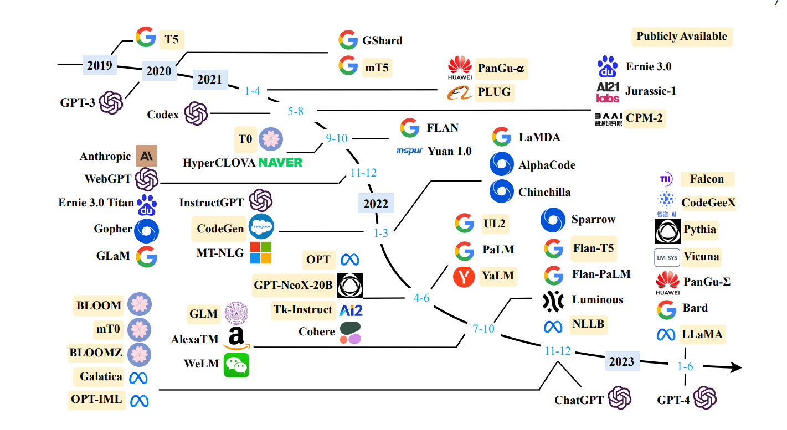
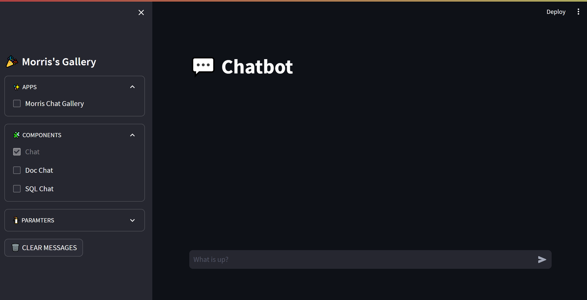
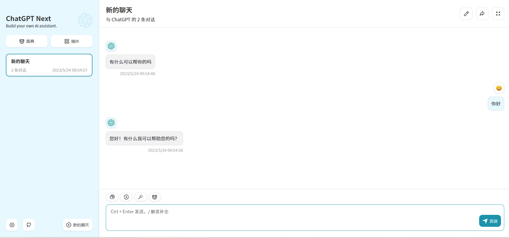
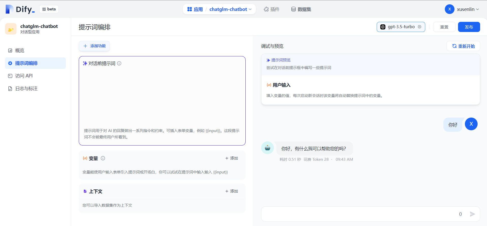

# API for Open LLMs

<p align="center">
    <a href="https://github.com/xusenlinzy/api-for-open-llm"></a>
    <a href=""></a>
    <a href=""></a>
    <a href="https://github.com/xusenlinzy/api-for-open-llm"></a>
    <a href="https://github.com/xusenlinzy/api-for-open-llm"></a>
    <a href="https://github.com/xusenlinzy/api-for-open-llm"></a>
    <a href="https://github.com/xusenlinzy/api-for-open-llm"></a>
</p>



<div align="center"> 图片来自于论文: [A Survey of Large Language Models](https://arxiv.org/pdf/2303.18223.pdf) </div>

  
## 🐧 QQ交流群：870207830


## 📢 新闻

+ 【2024.02.26】 QWEN2 模型需要修改环境变量 `MODEL_NAME=qwen2`  `PROMPT_NAME=qwen2`

+ 【2024.01.19】 添加 [InternLM2](https://github.com/InternLM/InternLM) 模型支持，[启动方式](https://github.com/xusenlinzy/api-for-open-llm/blob/master/docs/SCRIPT.md#internlm2)


+ 【2023.12.21】 添加 [TGI](https://github.com/huggingface/text-generation-inference) 生成接口转发和 [TEI](https://github.com/huggingface/text-embeddings-inference) embedding 接口转发


+ 【2023.12.06】 添加 [SUS-Chat-34B](https://huggingface.co/SUSTech/SUS-Chat-34B) 模型支持，[启动方式链接](https://github.com/xusenlinzy/api-for-open-llm/blob/master/docs/SCRIPT.md#suschat)


+ 【2023.11.24】 支持 [llama-cpp-python](https://github.com/abetlen/llama-cpp-python) 推理，[使用文档](https://github.com/xusenlinzy/api-for-open-llm/blob/master/docs/LLAMA_CPP.md)


+ 【2023.11.03】 支持 `chatglm3` 和 `qwen` 模型的 `function call` 调用功能，同时支持流式和非流式模式, [工具使用示例](https://github.com/xusenlinzy/api-for-open-llm/tree/master/examples/chatglm3/tool_using.py), 网页 `demo` 已经集成到 [streamlit-demo](./streamlit-demo)


+ 【2023.10.29】 添加 [ChatGLM3](https://github.com/THUDM/ChatGLM3) 模型支持，[启动方式链接](https://github.com/xusenlinzy/api-for-open-llm/blob/master/docs/SCRIPT.md#chatglm3)，[工具使用示例](https://github.com/xusenlinzy/api-for-open-llm/tree/master/examples/chatglm3)


+ 【2023.09.27】 添加 [Qwen-14B-Chat-Int4](https://huggingface.co/Qwen/Qwen-14B-Chat-Int4) 模型支持，[启动方式链接](https://github.com/xusenlinzy/api-for-open-llm/blob/master/docs/SCRIPT.md#qwen-14b-chat)


+ 【2023.09.07】 添加 [baichuan2](https://github.com/baichuan-inc/Baichuan2) 模型支持，[启动方式链接](https://github.com/xusenlinzy/api-for-open-llm/blob/master/docs/SCRIPT.md#baichuan2)


+ 【2023.08.28】 添加 `transformers.TextIteratorStreamer` 流式输出支持，只需将环境变量修改为 `USE_STREAMER_V2=true`


+ 【2023.08.26】 添加 [code-llama](https://github.com/facebookresearch/codellama) 模型支持，[启动方式链接](https://github.com/xusenlinzy/api-for-open-llm/blob/master/docs/SCRIPT.md#code-llama)，[使用示例链接](https://github.com/xusenlinzy/api-for-open-llm/tree/master/examples/code-llama)


+ 【2023.08.23】 添加 [sqlcoder](https://huggingface.co/defog/sqlcoder) 模型支持，[启动方式链接](https://github.com/xusenlinzy/api-for-open-llm/blob/master/docs/SCRIPT.md#sqlcoder)，[使用示例链接](https://github.com/xusenlinzy/api-for-open-llm/blob/master/examples/sqlcoder/inference.py)


+ 【2023.08.22】 添加 [xverse-13b-chat](https://github.com/xverse-ai/XVERSE-13B) 模型支持，[启动方式链接](https://github.com/xusenlinzy/api-for-open-llm/blob/master/docs/SCRIPT.md#xverse-13b-chat)


+ 【2023.08.10】 添加 [vLLM](https://github.com/vllm-project/vllm) 推理加速支持，[使用文档](https://github.com/xusenlinzy/api-for-open-llm/blob/master/docs/VLLM_SCRIPT.md)


+ 【2023.08.03】 添加 [qwen-7b-chat](https://github.com/QwenLM/Qwen-7B) 模型支持，[启动方式链接](https://github.com/xusenlinzy/api-for-open-llm/blob/master/docs/SCRIPT.md#qwen-7b-chat)


更多新闻和历史请转至 [此处](https://github.com/xusenlinzy/api-for-open-llm/blob/master/docs/NEWS.md)

---

**此项目主要内容**

此项目为开源大模型的推理实现统一的后端接口，与 `OpenAI` 的响应保持一致，具有以下特性：

+ ✨ 以 `OpenAI ChatGPT API` 的方式调用各类开源大模型


+ 🖨️ 支持流式响应，实现打印机效果


+ 📖 实现文本嵌入模型，为文档知识问答提供支持


+ 🦜️ 支持大规模语言模型开发工具 [`langchain` ](https://github.com/hwchase17/langchain) 的各类功能
 

+ 🙌 只需要简单的修改环境变量即可将开源模型作为 `chatgpt` 的替代模型，为各类应用提供后端支持


+ 🚀 支持加载经过自行训练过的 `lora` 模型


+ ⚡ 支持 [vLLM](https://github.com/vllm-project/vllm) 推理加速和处理并发请求


## 内容导引

|                                               章节                                                |              描述               |
|:-----------------------------------------------------------------------------------------------:|:-----------------------------:|
|               [💁🏻‍♂支持模型](https://github.com/xusenlinzy/api-for-open-llm#-支持模型)                |       此项目支持的开源模型以及简要信息        |
|       [🚄启动方式](https://github.com/xusenlinzy/api-for-open-llm/blob/master/docs/SCRIPT.md)       |        启动模型的环境配置和启动命令         |
|   [⚡vLLM启动方式](https://github.com/xusenlinzy/api-for-open-llm/blob/master/docs/VLLM_SCRIPT.md)   |   使用 `vLLM` 启动模型的环境配置和启动命令    |
| [🦙llama-cpp启动方式](https://github.com/xusenlinzy/api-for-open-llm/blob/master/docs/LLAMA_CPP.md) | 使用 `llama-cpp` 启动模型的环境配置和启动命令 |
|                 [💻调用方式](https://github.com/xusenlinzy/api-for-open-llm#-使用方式)                  |          启动模型之后的调用方式          |
|         [❓常见问题](https://github.com/xusenlinzy/api-for-open-llm/blob/master/docs/FAQ.md)         |           一些常见问题的回复           |
|     [📚相关资源](https://github.com/xusenlinzy/api-for-open-llm/blob/master/docs/RESOURCES.md)      |       关于开源模型训练和推理的相关资源        |


## 🐼 支持模型

**语言模型**

|                                  模型                                   |     基座模型     |   参数量    |   语言   |                                                   模型权重链接                                                    |
|:---------------------------------------------------------------------:|:------------:|:--------:|:------:|:-----------------------------------------------------------------------------------------------------------:|
|        [baichuan2](https://github.com/baichuan-inc/Baichuan2)         |   Baichuan   |   7/13   | en, zh |          [baichuan-inc/Baichuan2-13B-Chat](https://huggingface.co/baichuan-inc/Baichuan2-13B-Chat)          |
|      [codellama](https://github.com/facebookresearch/codellama)       |    LLaMA2    | 7/13/34B | multi  |       [codellama/CodeLlama-7b-Instruct-hf](https://huggingface.co/codellama/CodeLlama-7b-Instruct-hf)       |
|      [xverse-13b-chat](https://github.com/xverse-ai/XVERSE-13B)       |    Xverse    |   13B    | multi  |                   [xverse/XVERSE-13B-Chat](https://huggingface.co/xverse/XVERSE-13B-Chat)                   |
|           [qwen-7b-chat](https://github.com/QwenLM/Qwen-7B)           |     Qwen     |    7B    | en, zh |                 [Qwen/Qwen-7B-Chat](https://huggingface.co/baichuan-inc/Qwen/Qwen-7B-Chat)                  |
|   [baichuan-13b-chat](https://github.com/baichuan-inc/Baichuan-13B)   |   Baichuan   |   13B    | en, zh |           [baichuan-inc/Baichuan-13B-Chat](https://huggingface.co/baichuan-inc/Baichuan-13B-Chat)           |
|           [InternLM](https://github.com/InternLM/InternLM)            |   InternLM   |    7B    | en, zh |                [internlm/internlm-chat-7b](https://huggingface.co/internlm/internlm-chat-7b)                |
|           [InternLM2](https://github.com/InternLM/InternLM)           |  InternLM2   |   20B    | en, zh |        [internlm/internlm2-chat-20b](https://huggingface.co/internlm/internlm2-chat-20b)                    |
|           [ChatGLM2](https://github.com/THUDM/ChatGLM2-6B)            |     GLM      |  6/130B  | en, zh |                        [THUDM/chatglm2-6b](https://huggingface.co/THUDM/chatglm2-6b)                        |
|      [baichaun-7b](https://github.com/baichuan-inc/baichuan-7B)       |   Baichuan   |    7B    | en, zh |                 [baichuan-inc/baichuan-7B](https://huggingface.co/baichuan-inc/baichuan-7B)                 |
|        [Guanaco](https://github.com/artidoro/qlora/tree/main)         |    LLaMA     | 7/33/65B |   en   |           [timdettmers/guanaco-33b-merged](https://huggingface.co/timdettmers/guanaco-33b-merged)           |
|         [YuLan-Chat](https://github.com/RUC-GSAI/YuLan-Chat)          |    LLaMA     |  13/65B  | en, zh |            [RUCAIBox/YuLan-Chat-13b-delta](https://huggingface.co/RUCAIBox/YuLan-Chat-13b-delta)            |
|         [TigerBot](https://github.com/TigerResearch/TigerBot)         |    BLOOMZ    |  7/180B  | en, zh |            [TigerResearch/tigerbot-7b-sft](https://huggingface.co/TigerResearch/tigerbot-7b-sft)            |
|          [OpenBuddy](https://github.com/OpenBuddy/OpenBuddy)          | LLaMA、Falcon |    7B    | multi  |                                [OpenBuddy](https://huggingface.co/OpenBuddy)                                |
|               [MOSS](https://github.com/OpenLMLab/MOSS)               |   CodeGen    |   16B    | en, zh |              [fnlp/moss-moon-003-sft-int4](https://huggingface.co/fnlp/moss-moon-003-sft-int4)              |
|       [Phoenix](https://github.com/FreedomIntelligence/LLMZoo)        |    BLOOMZ    |    7B    | multi  | [FreedomIntelligence/phoenix-inst-chat-7b](https://huggingface.co/FreedomIntelligence/phoenix-inst-chat-7b) |
|        [BAIZE](https://github.com/project-baize/baize-chatbot)        |    LLaMA     | 7/13/30B |   en   |              [project-baize/baize-lora-7B](https://huggingface.co/project-baize/baize-lora-7B)              |
| [Chinese-LLaMA-Alpaca](https://github.com/ymcui/Chinese-LLaMA-Alpaca) |    LLaMA     |  7/13B   | en, zh |   [ziqingyang/chinese-alpaca-plus-lora-7b](https://huggingface.co/ziqingyang/chinese-alpaca-plus-lora-7b)   |
|             [BELLE](https://github.com/LianjiaTech/BELLE)             |    BLOOMZ    |    7B    |   zh   |                   [BelleGroup/BELLE-7B-2M](https://huggingface.co/BelleGroup/BELLE-7B-2M)                   |
|            [ChatGLM](https://github.com/THUDM/ChatGLM-6B)             |     GLM      |    6B    | en, zh |                         [THUDM/chatglm-6b](https://huggingface.co/THUDM/chatglm-6b)                         |


**嵌入模型**

|           模型           |  维度  |                                        权重链接                                         |
|:----------------------:|:----:|:-----------------------------------------------------------------------------------:|
|      bge-large-zh      | 1024 |              [bge-large-zh](https://huggingface.co/BAAI/bge-large-zh)               |
|       m3e-large        | 1024 |            [moka-ai/m3e-large](https://huggingface.co/moka-ai/m3e-large)            |
| text2vec-large-chinese | 1024 | [text2vec-large-chinese](https://huggingface.co/GanymedeNil/text2vec-large-chinese) |


## 🤖 使用方式

### 环境变量

+ `OPENAI_API_KEY`: 此处随意填一个字符串即可

+ `OPENAI_API_BASE`: 后端启动的接口地址，如：http://192.168.0.xx:80/v1


### [聊天界面](./applications)

```shell
cd streamlit-demo
pip install -r requirements.txt
streamlit run streamlit_app.py
```



### [openai v1.1.0](https://github.com/openai/openai-python)

<details>
<summary>👉 Chat Completions</summary>

```python
from openai import OpenAI

client = OpenAI(
    api_key="EMPTY",
    base_url="http://192.168.20.59:7891/v1/",
)

# Chat completion API
chat_completion = client.chat.completions.create(
    messages=[
        {
            "role": "user",
            "content": "你好",
        }
    ],
    model="gpt-3.5-turbo",
)
print(chat_completion)
# 你好👋！我是人工智能助手 ChatGLM3-6B，很高兴见到你，欢迎问我任何问题。


# stream = client.chat.completions.create(
#     messages=[
#         {
#             "role": "user",
#             "content": "感冒了怎么办",
#         }
#     ],
#     model="gpt-3.5-turbo",
#     stream=True,
# )
# for part in stream:
#     print(part.choices[0].delta.content or "", end="", flush=True)
```

</details>

<details>
<summary>👉 Completions</summary>

```python
from openai import OpenAI

client = OpenAI(
    api_key="EMPTY",
    base_url="http://192.168.20.59:7891/v1/",
)


# Chat completion API
completion = client.completions.create(
    model="gpt-3.5-turbo",
    prompt="你好",
)
print(completion)
# 你好👋！我是人工智能助手 ChatGLM-6B，很高兴见到你，欢迎问我任何问题。
```

</details>

<details>
<summary>👉 Embeddings</summary>

```python
from openai import OpenAI

client = OpenAI(
    api_key="EMPTY",
    base_url="http://192.168.20.59:7891/v1/",
)


# compute the embedding of the text
embedding = client.embeddings.create(
    input="你好",
    model="text-embedding-ada-002"
)
print(embedding)

```

</details>


### 可接入的项目

**通过修改 `OPENAI_API_BASE` 环境变量，大部分的 `chatgpt` 应用和前后端项目都可以无缝衔接！**

+ [ChatGPT-Next-Web: One-Click to deploy well-designed ChatGPT web UI on Vercel](https://github.com/Yidadaa/ChatGPT-Next-Web)

```shell
docker run -d -p 3000:3000 \
   -e OPENAI_API_KEY="sk-xxxx" \
   -e BASE_URL="http://192.168.0.xx:80" \
   yidadaa/chatgpt-next-web
```



+ [dify: An easy-to-use LLMOps platform designed to empower more people to create sustainable, AI-native applications](https://github.com/langgenius/dify)

```shell
# 在docker-compose.yml中的api和worker服务中添加以下环境变量
OPENAI_API_BASE: http://192.168.0.xx:80/v1
DISABLE_PROVIDER_CONFIG_VALIDATION: 'true'
```




## 📜 License

此项目为 `Apache 2.0` 许可证授权，有关详细信息，请参阅 [LICENSE](LICENSE) 文件。


## 🚧 References

+ [ChatGLM: An Open Bilingual Dialogue Language Model](https://github.com/THUDM/ChatGLM-6B)

+ [BLOOM: A 176B-Parameter Open-Access Multilingual Language Model](https://arxiv.org/abs/2211.05100)

+ [LLaMA: Open and Efficient Foundation Language Models](https://arxiv.org/abs/2302.13971v1)

+ [Efficient and Effective Text Encoding for Chinese LLaMA and Alpaca](https://github.com/ymcui/Chinese-LLaMA-Alpaca)

+ [Phoenix: Democratizing ChatGPT across Languages](https://github.com/FreedomIntelligence/LLMZoo)

+ [MOSS: An open-sourced plugin-augmented conversational language model](https://github.com/OpenLMLab/MOSS)

+ [FastChat: An open platform for training, serving, and evaluating large language model based chatbots](https://github.com/lm-sys/FastChat)

+ [LangChain: Building applications with LLMs through composability](https://github.com/hwchase17/langchain)

+ [ChuanhuChatgpt](https://github.com/GaiZhenbiao/ChuanhuChatGPT)


## Star History

[](https://star-history.com/#xusenlinzy/api-for-open-llm&Date)
