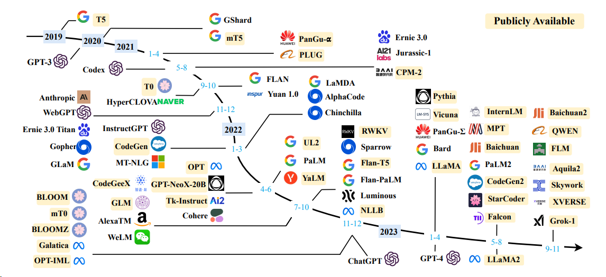

# API for Open LLMs

<p align="center">
    <a href="https://github.com/xusenlinzy/api-for-open-llm"></a>
    <a href=""></a>
    <a href=""></a>
    <a href="https://github.com/xusenlinzy/api-for-open-llm"></a>
    <a href="https://github.com/xusenlinzy/api-for-open-llm"></a>
    <a href="https://github.com/xusenlinzy/api-for-open-llm"></a>
    <a href="https://github.com/xusenlinzy/api-for-open-llm"></a>
</p>



<div align="center"> 图片来自于论文: [A Survey of Large Language Models](https://arxiv.org/pdf/2303.18223.pdf) </div>


## 📢 新闻

+ 【2024.06.13】 支持 `MiniCPM-Llama3-V-2_5` 模型，修改环境变量 `MODEL_NAME=minicpm-v`  `PROMPT_NAME=minicpm-v`  `DTYPE=bfloat16`


+ 【2024.06.12】 支持 `GLM-4V` 模型，修改环境变量 `MODEL_NAME=glm-4v`  `PROMPT_NAME=glm-4v`  `DTYPE=bfloat16`， 测试示例见 [glm4v](./tests/glm4v.py)


+ 【2024.06.08】 已支持 `QWEN2` 模型，修改环境变量 `MODEL_NAME=qwen2`  `PROMPT_NAME=qwen2`


+ 【2024.06.05】 支持 `GLM4` 模型，修改环境变量 `MODEL_NAME=chatglm4`  `PROMPT_NAME=chatglm4`


+ 【2024.04.18】 支持 `Code Qwen` 模型，[sql问答demo](https://github.com/xusenlinzy/api-for-open-llm/tree/master/streamlit-demo/streamlit_gallery/components/sql_chat)


+ 【2024.04.16】 支持 `Rerank` 重排序模型，[使用方式](./docs/RAG.md)


+ 【2024.02.26】 `QWEN1.5` 模型需要修改环境变量 `MODEL_NAME=qwen2`  `PROMPT_NAME=qwen2`


更多新闻和历史请转至 [此处](https://github.com/xusenlinzy/api-for-open-llm/blob/master/docs/NEWS.md)

---

**此项目主要内容**

此项目为开源大模型的推理实现统一的后端接口，与 `OpenAI` 的响应保持一致，具有以下特性：

+ ✨ 以 `OpenAI ChatGPT API` 的方式调用各类开源大模型


+ 🖨️ 支持流式响应，实现打印机效果


+ 📖 实现文本嵌入模型，为文档知识问答提供支持


+ 🦜️ 支持大规模语言模型开发工具 [`langchain` ](https://github.com/hwchase17/langchain) 的各类功能
 

+ 🙌 只需要简单的修改环境变量即可将开源模型作为 `chatgpt` 的替代模型，为各类应用提供后端支持


+ 🚀 支持加载经过自行训练过的 `lora` 模型


+ ⚡ 支持 [vLLM](https://github.com/vllm-project/vllm) 推理加速和处理并发请求


## 内容导引

|                                               章节                                                |              描述               |
|:-----------------------------------------------------------------------------------------------:|:-----------------------------:|
|               [💁🏻‍♂支持模型](https://github.com/xusenlinzy/api-for-open-llm#-支持模型)                |       此项目支持的开源模型以及简要信息        |
|       [🚄启动方式](https://github.com/xusenlinzy/api-for-open-llm/blob/master/docs/SCRIPT.md)       |        启动模型的环境配置和启动命令         |
|   [⚡vLLM启动方式](https://github.com/xusenlinzy/api-for-open-llm/blob/master/docs/VLLM_SCRIPT.md)   |   使用 `vLLM` 启动模型的环境配置和启动命令    |
|                 [💻调用方式](https://github.com/xusenlinzy/api-for-open-llm#-使用方式)                  |          启动模型之后的调用方式          |
|         [❓常见问题](https://github.com/xusenlinzy/api-for-open-llm/blob/master/docs/FAQ.md)         |           一些常见问题的回复           |


## 🐼 支持模型

**语言模型**

| 模型                                                 | 模型参数大小                           |
|----------------------------------------------------|----------------------------------|
| [Baichuan](https://huggingface.co/baichuan-inc)    | 7B/13B                           |
| [ChatGLM](https://huggingface.co/THUDM)            | 6B                               | 
| [DeepSeek](https://huggingface.co/deepseek-ai)     | 7B/16B/67B/236B                  | 
| [InternLM](https://huggingface.co/internlm)        | 7B/20B                           |
| [LLaMA](https://github.com/facebookresearch/llama) | 7B/13B/33B/65B                   | 
| [LLaMA-2](https://huggingface.co/meta-llama)       | 7B/13B/70B                       |
| [LLaMA-3](https://huggingface.co/meta-llama)       | 8B/70B                           | 
| [Qwen](https://huggingface.co/Qwen)                | 1.8B/7B/14B/72B                  | 
| [Qwen1.5](https://huggingface.co/Qwen)             | 0.5B/1.8B/4B/7B/14B/32B/72B/110B | 
| [Qwen2](https://huggingface.co/Qwen)               | 0.5B/1.5B/7B/57B/72B             |
| [Yi (1/1.5)](https://huggingface.co/01-ai)         | 6B/9B/34B                        |

启动方式详见 [vLLM启动方式](https://github.com/xusenlinzy/api-for-open-llm/blob/master/docs/VLLM_SCRIPT.md)、[transformers启动方式](https://github.com/xusenlinzy/api-for-open-llm/blob/master/docs/SCRIPT.md)

**嵌入模型**

|            模型             |  维度  |                                        权重链接                                         |
|:-------------------------:|:----:|:-----------------------------------------------------------------------------------:|
|       bge-large-zh        | 1024 |              [bge-large-zh](https://huggingface.co/BAAI/bge-large-zh)               |
|         m3e-large         | 1024 |            [moka-ai/m3e-large](https://huggingface.co/moka-ai/m3e-large)            |
|  text2vec-large-chinese   | 1024 | [text2vec-large-chinese](https://huggingface.co/GanymedeNil/text2vec-large-chinese) |
| bce-embedding-base_v1（推荐） | 768  | [bce-embedding-base_v1](https://huggingface.co/maidalun1020/bce-embedding-base_v1)  |


## 🤖 使用方式

### 环境变量

+ `OPENAI_API_KEY`: 此处随意填一个字符串即可

+ `OPENAI_API_BASE`: 后端启动的接口地址，如：http://192.168.0.xx:80/v1


### [聊天界面](./applications)

```shell
cd streamlit-demo
pip install -r requirements.txt
streamlit run streamlit_app.py
```


### [openai v1.1.0](https://github.com/openai/openai-python)

<details>
<summary>👉 Chat Completions</summary>

```python
from openai import OpenAI

client = OpenAI(
    api_key="EMPTY",
    base_url="http://192.168.20.59:7891/v1/",
)

# Chat completion API
chat_completion = client.chat.completions.create(
    messages=[
        {
            "role": "user",
            "content": "你好",
        }
    ],
    model="gpt-3.5-turbo",
)
print(chat_completion)
# 你好👋！我是人工智能助手 ChatGLM3-6B，很高兴见到你，欢迎问我任何问题。


# stream = client.chat.completions.create(
#     messages=[
#         {
#             "role": "user",
#             "content": "感冒了怎么办",
#         }
#     ],
#     model="gpt-3.5-turbo",
#     stream=True,
# )
# for part in stream:
#     print(part.choices[0].delta.content or "", end="", flush=True)
```

</details>

<details>
<summary>👉 Completions</summary>

```python
from openai import OpenAI

client = OpenAI(
    api_key="EMPTY",
    base_url="http://192.168.20.59:7891/v1/",
)


# Chat completion API
completion = client.completions.create(
    model="gpt-3.5-turbo",
    prompt="你好",
)
print(completion)
# 你好👋！我是人工智能助手 ChatGLM-6B，很高兴见到你，欢迎问我任何问题。
```

</details>

<details>
<summary>👉 Embeddings</summary>

```python
from openai import OpenAI

client = OpenAI(
    api_key="EMPTY",
    base_url="http://192.168.20.59:7891/v1/",
)


# compute the embedding of the text
embedding = client.embeddings.create(
    input="你好",
    model="text-embedding-ada-002"
)
print(embedding)

```

</details>


### 可接入的项目

**通过修改 `OPENAI_API_BASE` 环境变量，大部分的 `chatgpt` 应用和前后端项目都可以无缝衔接！**

+ [ChatGPT-Next-Web: One-Click to deploy well-designed ChatGPT web UI on Vercel](https://github.com/Yidadaa/ChatGPT-Next-Web)

```shell
docker run -d -p 3000:3000 \
   -e OPENAI_API_KEY="sk-xxxx" \
   -e BASE_URL="http://192.168.0.xx:80" \
   yidadaa/chatgpt-next-web
```


+ [dify: An easy-to-use LLMOps platform designed to empower more people to create sustainable, AI-native applications](https://github.com/langgenius/dify)

```shell
# 在docker-compose.yml中的api和worker服务中添加以下环境变量
OPENAI_API_BASE: http://192.168.0.xx:80/v1
DISABLE_PROVIDER_CONFIG_VALIDATION: 'true'
```


## 📜 License

此项目为 `Apache 2.0` 许可证授权，有关详细信息，请参阅 [LICENSE](LICENSE) 文件。


## 🚧 References

+ [ChatGLM: An Open Bilingual Dialogue Language Model](https://github.com/THUDM/ChatGLM-6B)

+ [BLOOM: A 176B-Parameter Open-Access Multilingual Language Model](https://arxiv.org/abs/2211.05100)

+ [LLaMA: Open and Efficient Foundation Language Models](https://arxiv.org/abs/2302.13971v1)

+ [Efficient and Effective Text Encoding for Chinese LLaMA and Alpaca](https://github.com/ymcui/Chinese-LLaMA-Alpaca)

+ [Phoenix: Democratizing ChatGPT across Languages](https://github.com/FreedomIntelligence/LLMZoo)

+ [MOSS: An open-sourced plugin-augmented conversational language model](https://github.com/OpenLMLab/MOSS)

+ [FastChat: An open platform for training, serving, and evaluating large language model based chatbots](https://github.com/lm-sys/FastChat)

+ [LangChain: Building applications with LLMs through composability](https://github.com/hwchase17/langchain)

+ [ChuanhuChatgpt](https://github.com/GaiZhenbiao/ChuanhuChatGPT)


## Star History

[](https://star-history.com/#xusenlinzy/api-for-open-llm&Date)
